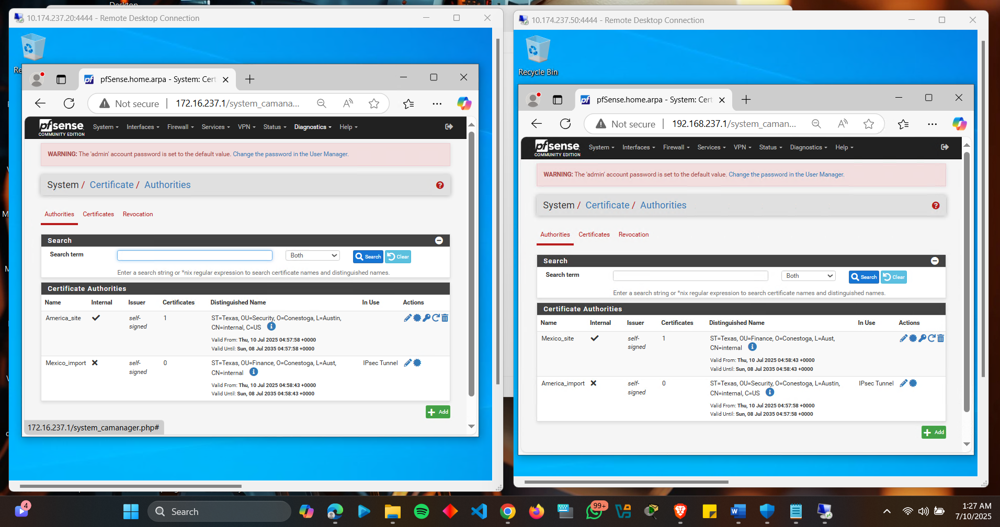
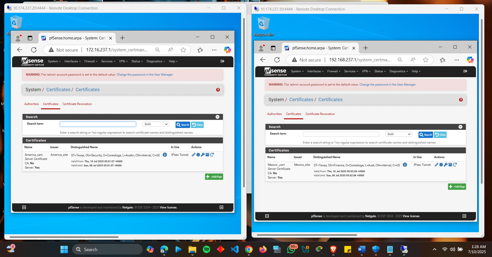
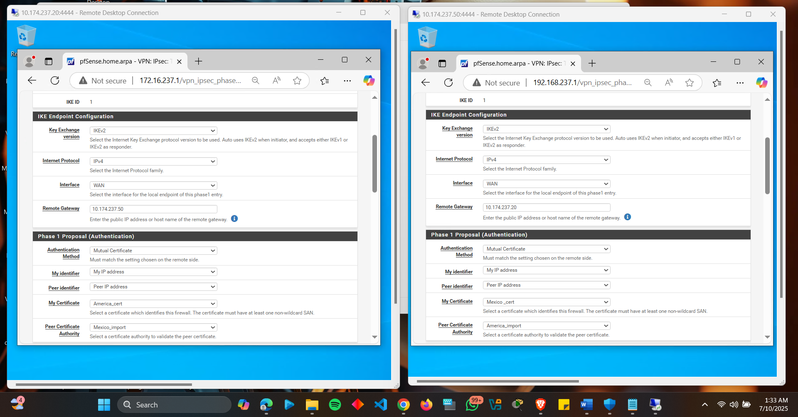
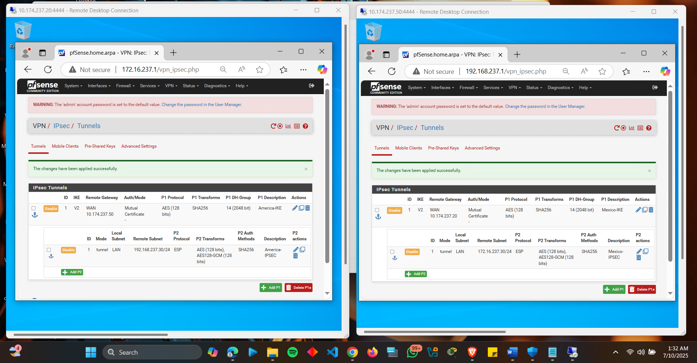
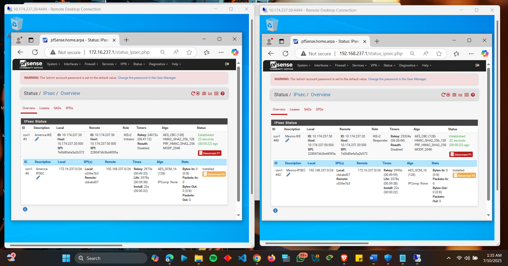
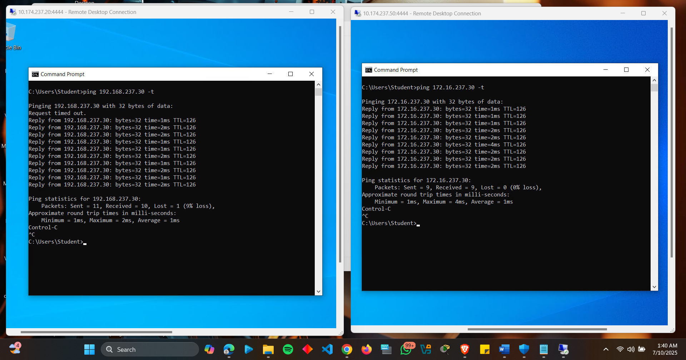

# Project 4: Certificate-Based Site-to-Site IPSEC VPN

## Overview
Configured a secure site-to-site VPN tunnel between two pfSense firewalls using **certificate-based authentication** (replacing pre-shared keys from Lab 3). Implemented Certificate Authorities (CAs), generated client certificates, and validated encrypted traffic between subnets `172.16.237.0/24` and `192.168.237.0/24`.

---

## Implementation Steps & Screenshots

### 1. Certificate Authority & Certificate Setup
- Created CAs named **"America_site"** (firewall01) and **"Mexico_site"** (firewall02)
- Generated certificates **"America_cert"** and **"Mexico_cert"** with proper Subject Alternative Names (SANs)

  
*CA creation on both firewalls*

  
*Assigned certificates for authentication*

---

### 2. IPSEC Tunnel Configuration
#### Phase 1 Settings (IKEv2):
- Authentication: **Mutual Certificates**  
- Encryption: `AES-128`  
- Hashing: `SHA256`  
- DH Group: `14`  

#### Phase 2 Settings (IPSec):
- Protocol: `ESP`  
- Encryption: `AES-128` + `AES-256-GCM`  
- Hashing: `SHA256`  
- Local/Remote Subnets: `172.16.237.0/24` ↔ `192.168.237.0/24`  

  
*Certificate-based Phase 1 setup*

  
*Encryption and subnet mapping*

---

### 3. Validation & Testing
- Verified tunnel status showed both phases as **"Active"**
- Conducted cross-network ping tests between Windows VMs:

  
*Successful Phase 1/2 establishment*

  
*Encrypted ping between `172.16.237.30` and `192.168.237.30`*

---

## Key Challenges & Solutions
| Challenge | Solution |
|-----------|----------|
| Tunnel failed due to missing SANs | Regenerated certificates with correct Common Names |
| Phase 1 mismatched settings | Aligned encryption/hashing parameters on both firewalls |
| Certificate expiration warnings | Set 5-year validity period during creation |

---

## Advantages of Certificate Authentication
✅ **Stronger Security**: Resistant to brute-force attacks compared to pre-shared keys  
✅ **Scalability**: Central CA simplifies management for large deployments  
⚠️ **Complexity**: Requires proper CA setup and certificate lifecycle management  

---

## How to Reproduce
1. **Prerequisites**:
   - Two pfSense firewalls with WAN/LAN interfaces configured
   - Windows VMs on each LAN subnet

2. **Steps**:
   ```bash
   # On pfSense web UI:
   1. System > Cert. Manager > Create CAs
   2. Generate certificates with SANs
   3. VPN > IPsec > Configure Phase 1/2 with certificates
   4. Validate under Status > IPsec